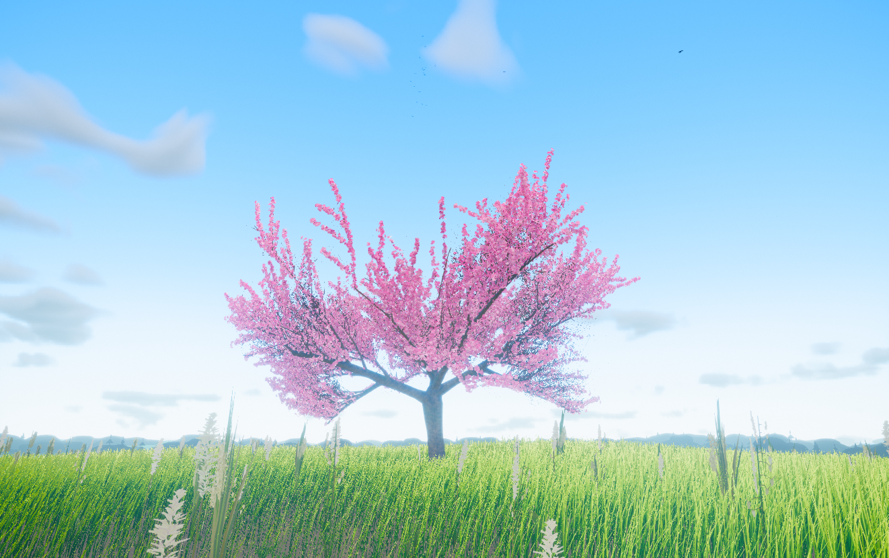
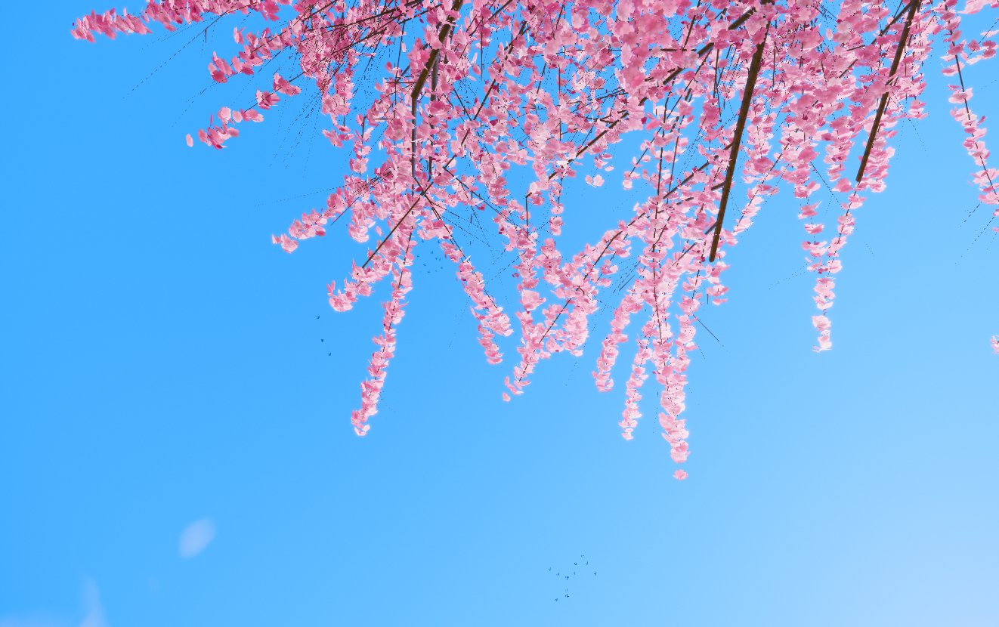

<div align="center">

# Sakura Realm

**A real-time cherry blossom landscape that runs in your browser.**

Volumetric sky, dynamic weather, an endless wind-driven meadow,
and one procedurally grown sakura tree.

No models. No textures. No image files anywhere in the render path.
Every texture is synthesised on load and every mesh is built in code,
so the whole world ships as source.

[Quick start](#quick-start) · [Controls](#controls) · [How it works](#how-it-works) · [Performance](#performance)

</div>

---



## What is in it

- **A procedurally grown sakura.** A recursive branch skeleton is grown under competing tropisms against a crown envelope, then swept into welded tapered tubes. 774,000 blossoms are placed on the resulting twig cloud; 515,000 are drawn at the default quality tier.
- **Volumetric clouds.** Raymarched at reduced resolution with temporal reprojection, Beer-Powder scattering and a dual-lobe Henyey-Greenstein phase.
- **An endless meadow.** Hundreds of thousands of instanced blades stream in chunks around the camera, bending in a shared divergence-free wind field. Three sward modes, from mown lawn to waist-high.
- **A full day and night cycle.** Physically based Rayleigh and Mie scattering, sun and moon with real phase, a star field, and auto-exposure across all 24 hours.
- **Weather.** Clear through overcast, rain, storm, fog and a petal storm, continuously blended rather than switched.
- **Falling petals.** Real aerodynamics: flutter, tumble and drag, advected by the same wind field the grass and the branches read.


## Quick start

```bash
npm install
npm run dev
```

Open the URL Vite prints. For a production build:

```bash
npm run build && npm run preview
```

Requires a browser with WebGL2.

## Controls

| Key | Action |
|---|---|
| Click | Capture the mouse |
| `W` `A` `S` `D` | Move |
| Mouse | Look |
| `Shift` | Sprint |
| `Space` | Jump, or ascend when flying |
| `Ctrl` | Crouch, or descend when flying |
| `F` | Toggle walk and fly |
| `G` | Cycle grass: lawn, meadow, tall |
| `Tab` | Settings: weather, time of day, wind, quality |
| `H` | Hide the HUD |
| `Esc` | Release the mouse |



## How it works

`src/main.js` owns system order and nothing else. Every subsystem is a class following one lifecycle contract:

```js
constructor(ctx) -> async init() -> link(systems) -> update(dt, state) -> dispose()
```

`src/core/state.js` is the single mutable source of truth. Every field has exactly one owning system, marked `@owner`. Systems read anything and write only what they own. That one constraint is what keeps a scene this interconnected from collapsing into a tangle of cross-references.

```
src/
  core/      renderer, quality tiers, procedural textures, input, state, math
  sky/       atmospheric scattering, sun, moon, stars, volumetric clouds
  weather/   wind field, weather state machine, precipitation, fog, lightning
  world/     infinite terrain, instanced grass, scatter detail, birds
  tree/      the sakura: skeleton, bark, blossoms, falling petals
  player/    walk and fly controller
  post/      post-processing pipeline
  ui/        HUD, settings panel, loading screen
```

[CONTRACTS.md](CONTRACTS.md) documents the full build contract: module ownership, cross-module interfaces, shader conventions and the per-system frame budget.

### The tree

The sakura is not a model. It is grown.

A recursive generator produces a branch skeleton under four competing tropisms: gravity, phototropism, crowding avoidance, and a crown envelope that decides the silhouette. Radii follow the pipe model at every fork, and branch length follows from radius through a single allometric law, so a heavy limb comes out long and a twig comes out short without a per-level constant anywhere.

Blossoms are then placed on that twig cloud by a light-transport approximation rather than a radial falloff. Each site's flowering rate is set by how much skylight reaches it through the foliage above and the crown flank beside it, which is why the canopy is dense on its lit shell and thinner inside, the way a real cherry actually flowers.

The generator is pure and runs under plain Node with no GL context, so the tree can be measured before it is ever rendered.

## Performance

The reference target is an AMD Radeon 780M, an integrated GPU, and that constraint drove most of the engineering. Clouds raymarch at reduced resolution with temporal reprojection. Grass streams in chunks and uses instance count as its level of detail, so there is no second geometry and no transition seam. Post-processing effects are merged into a single fullscreen pass.

Quality auto-detects on first run and adapts at runtime. All four tiers are real: `low` genuinely costs less rather than merely looking worse, and an adaptive resolution controller holds the target framerate under load.

```bash
node scripts/check-integration.mjs
```

A static check across every module for export mismatches, state ownership violations, allocation in hot paths, and syntax errors.

## Built with

[three.js](https://threejs.org/) · [postprocessing](https://github.com/pmndrs/postprocessing) · [Vite](https://vitejs.dev/)

## License

[MIT](LICENSE)
